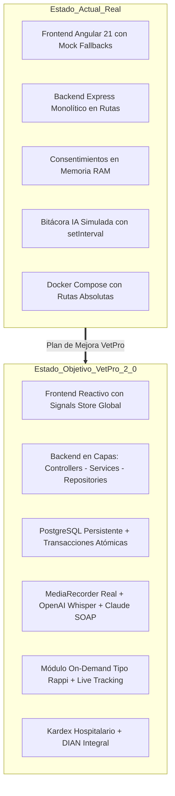
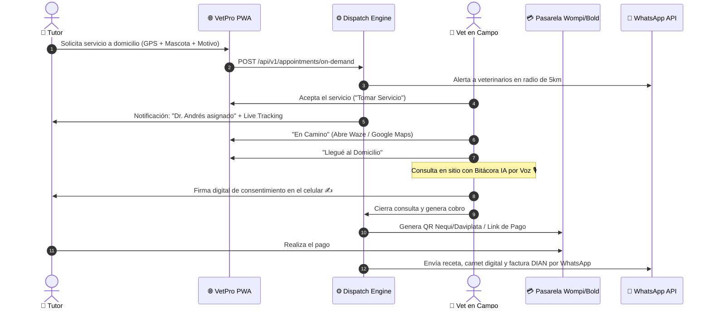
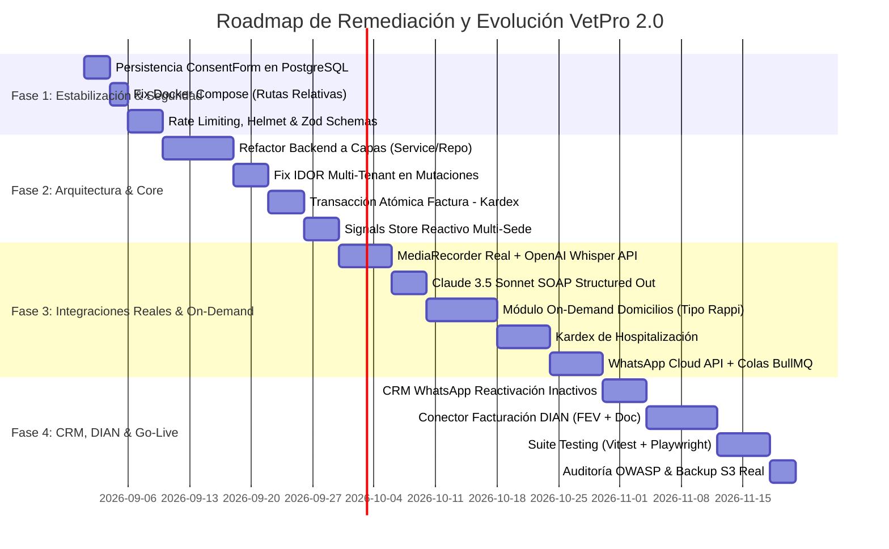

# 🚀 VetPro — Plan Maestro de Mejora & Evolución Arquitectónica

**Documento de Diagnóstico Técnico, Plan de Remediación y Evolución Estratégica**  
**Fecha de Publicación:** Agosto 2026  
**Versión:** 2.0 (Incluye Modelo Clínico Tradicional, On-Demand Domiciliario y Cumplimiento Fiscal)  
**Autor:** Antigravity Architect Team

---

## 📑 Tabla de Contenidos
1. [Diagnóstico General & Estado del Arte del Repositorio](#1-diagnóstico-general--estado-del-arte-del-repositorio)
2. [Auditoría Técnica y Hallazgos por Capas](#2-auditoría-técnica-y-hallazgos-por-capas)
   - [2.1 Backend (Node.js/Express/Prisma)](#21-backend-nodejs-express-prisma)
   - [2.2 Frontend (Angular 21 Signals)](#22-frontend-angular-21-signals)
   - [2.3 Base de Datos (PostgreSQL 15)](#23-base-de-datos-postgresql-15)
   - [2.4 DevOps, Docker & CI/CD](#24-devops-docker--cicd)
3. [Nuevos Módulos Estratégicos Incorporados](#3-nuevos-módulos-estratégicos-incorporados)
   - [3.1 Módulo On-Demand & Veterinarios a Domicilio ("Tipo Rappi")](#31-módulo-on-demand--veterinarios-a-domicilio-tipo-rappi)
   - [3.2 Módulo de Hospitalización & Kardex de Enfermería](#32-módulo-de-hospitalización--kardex-de-enfermería)
   - [3.3 CRM de Reactivación de Clientes Inactivos por WhatsApp](#33-crm-de-reactivación-de-clientes-inactivos-por-whatsapp)
   - [3.4 Facturación Electrónica DIAN Integral (FEV + Doc. Soporte)](#34-facturación-electrónica-dian-integral-fev--doc-soporte)
4. [Plan de Ejecución por Fases (Roadmap de Remediación)](#4-plan-de-ejecución-por-fases-roadmap-de-remediación)
5. [Matriz de Riesgos y Deuda Técnica Priorizada](#5-matriz-de-riesgos-y-deuda-técnica-priorizada)

---

## 1. Diagnóstico General & Estado del Arte del Repositorio

El proyecto **VetPro** cuenta con una base de código moderna y bien maquetada en Angular 21 (Signals, Standalone) y Node.js/Prisma. Sin embargo, tras la auditoría técnica profunda, se detectaron discrepancias sustanciales entre lo planificado en el sprint plan original y el estado real de implementación:



---

## 2. Auditoría Técnica y Hallazgos por Capas

### 2.1 Backend (Node.js / Express / Prisma)

| # | Hallazgo / Vulnerabilidad | Ubicación en Código | Severidad | Acción Requerida |
|---|---------------------------|---------------------|:---------:|------------------|
| **B1** | **Acoplamiento Monolítico en Rutas** | `src/routes/*.ts` | 🔴 Alta | Desacoplar en `controllers/`, `services/`, `repositories/` y `schemas/`. |
| **B2** | **Vulnerabilidad Multi-Tenant IDOR** | `patient.routes.ts:185`, `billing.routes.ts:229` | 🔴 Crítica | Validar que `tutorId`, `appointmentId`, `productId` pertenezcan estrictamente al `clinicId` del usuario. |
| **B3** | **Pérdida de Datos en Consentimientos** | `consent.routes.ts:23-52` | 🔴 Crítica | Eliminar `MEMORY_CONSENTS = []` en RAM y crear el modelo `ConsentForm` en PostgreSQL. |
| **B4** | **Condición de Carrera en Consecutivo de Factura** | `billing.routes.ts:243` | 🔴 Alta | Reemplazar `prisma.invoice.count() + 1` por secuencia atómica / bloqueo transaccional. |
| **B5** | **Desconexión Facturación - Kardex** | `billing.routes.ts:270` | 🔴 Alta | Envolver en `prisma.$transaction` la creación de factura y la salida de stock en `InventoryMovement`. |
| **B6** | **Mocks Silenciosos en Base de Datos** | `billing.routes.ts:61`, `appointment.routes.ts:94` | 🟠 Media | Eliminar los bloques `catch` que devuelven JSON mock; retornar errores HTTP 5xx descriptivos. |
| **B7** | **Seguridad & Rate Limiting** | `src/app.ts:23-40` | 🟠 Media | Implementar `helmet`, `express-rate-limit` (5 intentos/minuto en auth) y esquemas `zod`. |
| **B8** | **JWT sin Refresh Tokens** | `auth.routes.ts:68` | 🟡 Media | Implementar tokens de acceso cortos (15m) y Refresh Tokens rotativos con revocación. |

---

### 2.2 Frontend (Angular 21 Signals)

| # | Hallazgo Técnico | Ubicación en Código | Severidad | Acción Requerida |
|---|------------------|---------------------|:---------:|------------------|
| **F1** | **Bitácora IA con Grabación Falsa** | `bitacora-ai.component.ts:152` | 🔴 Alta | Implementar `MediaRecorder API` real, captura de audio binario y envío multipart a Whisper. |
| **F2** | **Reload Forzado en Multi-Sucursal** | `layout/shell.component.ts` | 🟠 Media | Emitir el cambio de sede mediante Signal reactivo `activeBranch` en `AuthService` sin recargar la app. |
| **F3** | **Módulos Placeholder / Stubs** | `notification-center.component.ts:9` | 🟠 Media | Sustituir el texto "Módulo en construcción" por la bandeja real de notificaciones. |
| **F4** | **Guardado Simulado con setTimeout** | `notification-templates.component.ts:128` | 🟠 Media | Conectar el guardado de plantillas al API REST del backend. |
| **F5** | **Código Muerto & Boilerplate** | `src/app/app.html` (20KB) | 🟢 Baja | Eliminar archivo huérfano de boilerplate y limpiar carpetas vacías en `shared/components/`. |
| **F6** | **Playwright Inoperativo** | `package.json`, `e2e/e2e.spec.ts` | 🟠 Media | Instalar `@playwright/test` en `devDependencies` y crear `playwright.config.ts`. |

---

### 2.3 Base de Datos (PostgreSQL 15)

1. **Modelo `ConsentForm` Faltante:**
   El esquema carece de la tabla de consentimientos. Se debe aplicar la siguiente migración:
   ```prisma
   model ConsentForm {
     id           String    @id @default(uuid())
     clinicId     String
     clinic       Clinic    @relation(fields: [clinicId], references: [id], onDelete: Cascade)
     patientId    String
     patient      Patient   @relation(fields: [patientId], references: [id], onDelete: Cascade)
     title        String
     content      String    @db.Text
     signatureUrl String?   @db.Text
     signed       Boolean   @default(false)
     signedAt     DateTime?
     expiresAt    DateTime
     token        String    @unique @default(uuid())
     createdAt    DateTime  @default(now())

     @@index([clinicId])
     @@index([token])
     @@map("consent_forms")
   }
   ```

2. **Unicidad de Emails por Clínica:**
   En `model User`, cambiar `@unique` en `email` por `@@unique([clinicId, email])` para permitir que el mismo email pueda ser registrado en diferentes clínicas si es un veterinario externo.

3. **Soft Deletes:**
   Añadir `deletedAt DateTime?` e índice en `Patient`, `Tutor`, `Appointment`, `Product`, `Invoice`.

---

### 2.4 DevOps, Docker & CI/CD

1. **Rutas Absolutas en `stacks/vetpro/docker-compose.yml`:**
   * **Problema:** Rutas fijas a `/home/djfa/Dev/projects/vet-Pro/...` rompen el despliegue en cualquier servidor.
   * **Solución:** Reemplazar por rutas relativas (`../../vetpro-backend` y `../../vetpro-angular/vetpro`).

2. **Carrera en GitHub Actions:**
   * **Problema:** `ci.yml` y `deploy.yml` corren en paralelo al hacer push a `main`.
   * **Solución:** Agregar `needs: [build-and-push]` o unificar en un solo workflow `pipeline.yml`.

3. **Migraciones en Despliegue:**
   * Cambiar `npx prisma db push` por `npx prisma migrate deploy` en `deploy.sh`.

4. **Backups Reales en S3:**
   * Reemplazar el `sleep 1` de `scripts/backup-s3.sh` por la llamada real al CLI de AWS: `aws s3 cp ${BACKUP_FILE} s3://${S3_BUCKET}/backups/`.

---

## 3. Nuevos Módulos Estratégicos Incorporados

---

### 3.1 Módulo On-Demand & Veterinarios a Domicilio ("Tipo Rappi")

Permite gestionar la atención veterinaria domiciliaria con la agilidad y experiencia de una aplicación tipo Rappi/Uber.



#### Novedades Técnicas en Base de Datos para Domicilios:
```prisma
enum ServiceModality {
  CLINIC
  HOME_VISIT
  TELEMEDICINE
}

enum TrackingStatus {
  REQUESTED
  ASSIGNED
  ON_THE_WAY
  ARRIVED
  IN_PROGRESS
  COMPLETED
  CANCELLED
}

model MobileInventory {
  id        String   @id @default(uuid())
  clinicId  String
  vetId     String
  productId String
  quantity  Int      @default(0)
  updatedAt DateTime @updatedAt

  clinic    Clinic   @relation(fields: [clinicId], references: [id])
  vet       User     @relation(fields: [vetId], references: [id])
  product   Product  @relation(fields: [productId], references: [id])

  @@unique([vetId, productId])
  @@map("mobile_inventories")
}
```

---

### 3.2 Módulo de Hospitalización & Kardex de Enfermería

Inspirado en las mejores prácticas clínicas de OKvet Pro para pacientes internados:
* **Mapa de Camas / Jaulas:** Gestión visual de ocupación (Libre, Ocupada, En Limpieza, Aislado).
* **Kardex Horario:** Programación de administración de medicamentos cada 6h/8h/12h con checklist digital.
* **Descarga Automática de Farmacia:** Cada dosis marcada como administrada descuenta inmediatamente del inventario general.
* **Hoja de Constantes Fisiológicas:** Registro gráfico de temperatura, frecuencia cardíaca, presión y peso diario.

---

### 3.3 CRM de Reactivación de Clientes Inactivos por WhatsApp

* **Segmentación Automática:**
  * Pacientes sin visitas en los últimos 3, 6 o 12 meses.
  * Mascotas con vacunas o desparasitaciones vencidas.
* **Campañas Masivas con WhatsApp Business API:**
  * Mensajes personalizados con plantillas de Meta: *"Hola {tutor}, hace 6 meses no vemos a {mascota}. Agenda su chequeo preventivo con 15% de descuento aquí: {link}"*.
* **Tracking de Retorno:** Medición de citas agendadas y facturación recuperada por cada campaña.

---

### 3.4 Facturación Electrónica DIAN Integral (Colombia)

* **Factura Electrónica de Venta (FEV):** Generación de XML UBL 2.1 firmado con certificado digital, cálculo de CUFE y código QR.
* **Documento Soporte Electrónico en Adquisiciones:** Para compras y gastos con proveedores que no están obligados a expedir factura (personal de aseo, insumos locales).
* **Notas Crédito Electrónicas:** Anulación y corrección de facturas directamente ante la DIAN.

---

## 4. Plan de Ejecución por Fases (Roadmap de Remediación)



---

## 5. Matriz de Riesgos y Deuda Técnica Priorizada

| Riesgo / Deuda Técnica | Impacto | Probabilidad | Nivel de Riesgo | Plan de Mitigación Inmediato |
| :--- | :---: | :---: | :---: | :--- |
| **Pérdida de firmas legales por reinicio de Docker** | Catastrófico | Alta | 🔴 **Crítico (P0)** | Aplicar migración `ConsentForm` a PostgreSQL y eliminar el array en RAM. |
| **Fuga de datos entre clínicas (IDOR)** | Catastrófico | Media | 🔴 **Crítico (P0)** | Validar la propiedad del `clinicId` en cada consulta Prisma antes de asociar entidades. |
| **Fallo de despliegue en servidor remoto** | Alto | Alta | 🔴 **Crítico (P0)** | Cambiar rutas absolutas por relativas en `stacks/vetpro/docker-compose.yml`. |
| **Colisión de números de factura en alta concurrencia** | Alto | Media | 🟠 **Alto (P1)** | Implementar secuencia atómica de facturación en base de datos. |
| **Agotamiento de cuota de IA por falta de control** | Medio | Alta | 🟠 **Alto (P1)** | Implementar medidor de minutos consumidos con corte automático de plan. |
| **Falta de cobertura de pruebas en despliegues** | Alto | Alta | 🟠 **Alto (P1)** | Instalar Playwright y Vitest, bloqueando el merge a `main` si los tests fallan. |

---

### 💡 Próximo Paso Recomendado

Con este plan maestro estructurado y aprobado, la recomendación técnica es **proceder inmediatamente con la Fase 1 (Persistencia de `ConsentForm`, corrección de Docker Compose y validación Zod)** para dejar el núcleo de la aplicación estable, seguro y listo para las integraciones reales.
