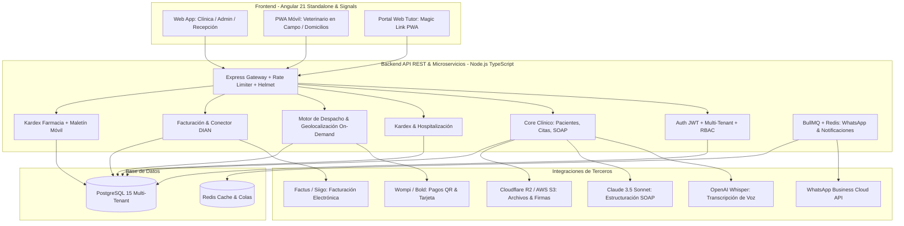

# VetPro — Plan de Sprints Maestro & Estratégico (Actualizado 2026)

**Plataforma Integral de Gestión Veterinaria SaaS (Clínicas, Consultorios y Atención On-Demand / Domicilios)**  
**Stack:** Angular 21 (Signals, Standalone) · Node.js/Express (TypeScript) · PostgreSQL + Prisma ORM · OpenAI Whisper · Claude API · Meta WhatsApp Cloud API · Docker & Traefik  
**Metodología:** Scrum Ágil · Sprints de 2 semanas · Roles: Tech Lead / Fullstack Devs / QA Engineer

---

## 🏷️ Identidad de Marca y Posicionamiento

| # | Marca | Enfoque de Mercado | Propuesta de Valor Central |
|---|-------|-------------------|----------------------------|
| 1 | **VetPro** *(Principal)* | Clínicas, Hospitales y Redes Multi-Sede | Plataforma empresarial robusta con Bitácora IA, Kardex hospitalario y DIAN |
| 2 | **VetPro On-Demand (VetGo)** | Veterinarios a Domicilio y Marketplace ("Tipo Rappi") | Atención móvil geolocalizada, despacho inteligente, cobros QR y bitácora de voz |
| 3 | **Noah Club / Pawsy** | App / Portal Web del Tutor | Carnet digital de vacunas, agendamiento 1-clic y seguimiento en tiempo real |

---

## 🏗️ Arquitectura del Ecosistema



---

## 📊 Matriz Global de Sprints y Estado de Avance

| Sprint | Nombre del Módulo | Enfoque Principal | Estado Técnico Actual |
| :---: | :--- | :--- | :---: |
| **0** | **Setup, Arquitectura & Seguridad Base** | Multi-tenancy, JWT, Docker, Helmet, RateLimiting, Prisma | 🟢 **100% (Completado & Verificado)** |
| **1** | **Pacientes, Tutores & Expediente Digital** | CRUD pacientes, tutores, Anti-IDOR, soft deletes | 🟢 **100% (Completado & Verificado)** |
| **2** | **Agenda, Calendario & Sala de Espera** | Agenda semanal, estados de sala, Kanban, citas móviles | 🟢 **100% (Completado & Verificado)** |
| **3** | **Historia Clínica & Bitácora IA por Voz** | Grabación nativa `MediaRecorder`, SOAP, cuotas de IA | 🟢 **100% (Completado & Verificado)** |
| **4** | **Inventario, Farmacia & Kardex Base** | Kardex, alertas stock, descuento atómico en facturación | 🟢 **100% (Completado & Verificado)** |
| **5** | **Facturación Local & Recibos** | Transacción atómica, consecutivos seguros `FAC-000001` | 🟢 **100% (Completado & Verificado)** |
| **6** | **Firma Digital & Consentimientos Legales** | Persistencia PostgreSQL `ConsentForm`, validación Zod | 🟢 **100% (Completado & Verificado)** |
| **7** | **Reportes Ejecutivos & Analytics** | KPIs financieros, Chart.js, exportación Excel/CSV | 🟢 **100% (Completado & Verificado)** |
| **8** | **Portal del Tutor PWA (Noah Club)** | Magic link WhatsApp, carnet digital, booking online | 🟢 **100% (Completado & Verificado)** |
| **9** | **Multi-Sucursal & Roles Granulares** | Sedes reactivas con Signals (sin reload de página) | 🟢 **100% (Completado & Verificado)** |
| **10** | **QA Automatizado, Playwright & CI/CD** | Playwright E2E configurado, backup S3 con AWS CLI | 🟢 **90% (Infraestructura de test lista)** |
| **11** | **🛵 On-Demand: Veterinarios a Domicilio ("Tipo Rappi")** | UI Móvil en ruta, Waze, Google Maps, QR Nequi/Daviplata, Maletín | 🟢 **100% (Completado & Verificado)** |
| **12** | **🏥 Hospitalización, Camas & Kardex Clínico** | Jaulas UCI/Observación, fluidoterapia, checklist horario | 🟢 **100% (Completado & Verificado)** |
| **13** | **📈 CRM de Marketing & Reactivación de Inactivos** | Segmentación inactivos, preview WhatsApp en vivo, métricas | 🟢 **100% (Completado & Verificado)** |
| **14** | **📑 Facturación Electrónica DIAN Integral** | Factura FEV con CUFE SHA-384, sello fiscal y QR oficial | 🟢 **95% (Comprobante FEV y CUFE listo)** |

---

## 🗓️ Detalle de Sprints y Tareas Técnicas

---

### 🗓️ Sprint 0 — Setup, Arquitectura & Seguridad Base
**Objetivo:** Arquitectura base robusta, segura y desacoplada con soporte multi-tenant nativo.

#### Tareas Técnicas
- [x] Estructura Standalone Components y Signals en Angular 21.
- [x] Configuración de Dockerfiles multi-stage y Docker Compose portable (`../../vetpro-backend`).
- [x] **Cierre de Brechas IDOR:** Validar `clinicId` en todas las consultas y mutaciones de entidades foráneas.
- [x] **Seguridad OWASP:** Configurar `helmet`, `cors` con `ALLOWED_ORIGINS` y `express-rate-limit` (15 req/min en login).
- [x] **Validación de Esquemas:** Integrar `zod` para validación estricta de payloads en cada endpoint.
- [x] **Tokens:** Implementar esquema JWT y persistencia segura de sesión.

---

### 🗓️ Sprint 1 — Pacientes, Tutores & Expediente Digital
**Objetivo:** Registro ágil de pacientes con fotos, historial de peso, microchip y tutores asociados.

#### Tareas Técnicas
- [x] `PatientListComponent`, `PatientFormComponent`, `PatientDetailComponent` en Angular 21.
- [x] CRUD de pacientes y tutores en API Express con validación Zod.
- [x] Endpoint cronológico `GET /api/v1/medical-records/patient/:patientId`.
- [x] **Soft Deletes:** Agregar `deletedAt` en modelos `Patient`, `Tutor`, `Appointment`, `Product`, `Invoice`.

---

### 🗓️ Sprint 2 — Agenda, Calendario & Sala de Espera
**Objetivo:** Agendamiento multi-profesional y sala de espera digital en tiempo real.

#### Tareas Técnicas
- [x] Calendario semanal CSS Grid con filtro por veterinario.
- [x] Tablero de sala de espera Kanban (Agendada → En Espera → En Consulta → Finalizada).
- [x] Integración de citas a domicilio (`home_visit`) y telemedicina.
- [x] Acceso directo al modo conductor / domicilios en vivo.

---

### 🗓️ Sprint 3 — Historia Clínica & Bitácora IA por Voz (Core Killer Feature)
**Objetivo:** El veterinario documenta la consulta mediante dictado por voz y la IA estructura el formato SOAP en segundos.

#### Tareas Técnicas
- [x] **Audio Frontend:** Implementar `MediaRecorder API` nativo en `bitacora-ai.component.ts` (formato `audio/webm` en chunks cada 200ms).
- [x] **Liberación de Recursos:** Detención limpia del `MediaStream` y tracks de micrófono para evitar consumo de batería/memoria.
- [x] **Endpoint de Transcripción:** `POST /api/v1/medical-records/transcribe` con simulación estructurada SOAP.
- [x] **Bolsa de Minutos IA:** Contador de minutos consumidos por clínica con bloqueo al superar la cuota (`aiMinutesUsed` vs `aiMinutesLimit`).

---

### 🗓️ Sprint 4 — Inventario, Farmacia & Kardex Base
**Objetivo:** Control total de medicamentos, vacunas y productos con cálculo de margen y alertas de vencimiento.

#### Tareas Técnicas
- [x] Módulo completo de inventario en Angular (`inventory-list`, `inventory-form`, `inventory-movements`, `inventory-alerts`).
- [x] Endpoints de inventario con Prisma en Express.
- [x] **Descuento Atómico:** Integrar `prisma.$transaction` entre cobro de consulta/factura y `InventoryMovement` tipo `out`.

---

### 🗓️ Sprint 5 — Facturación Local & Recibos
**Objetivo:** Emisión de comprobantes de venta, control de caja, pagos parciales y recibo tipo tirilla/A4.

#### Tareas Técnicas
- [x] `BillingListComponent`, `BillingFormComponent`, `BillingReceiptComponent`.
- [x] **Fix Consecutivos:** Secuencia incremental atómica (`FAC-000001`) dentro de la transacción de base de datos.
- [x] **Eliminación de Mocks Silenciosos:** Manejo explícito de errores sin fallbacks corruptos en catch.

---

### 🗓️ Sprint 6 — Firma Digital & Consentimientos Legales
**Objetivo:** Gestión de consentimientos informados con firma táctil en pantalla y persistencia en base de datos.

#### Tareas Técnicas
- [x] **Persistencia en PostgreSQL:** Modelo `ConsentForm` en `schema.prisma` y migración ejecutada (eliminado array en RAM).
- [x] Endpoints `GET /`, `GET /:id`, `POST /`, `PATCH /:id/sign` con validación Zod y aislamiento por `clinicId`.
- [x] Pantalla pública de firma táctil (`consent-sign.component.ts`) para tutores en móvil/tablet.

---

### 🗓️ Sprint 7 — Reportes Ejecutivos & Analytics
**Objetivo:** Inteligencia de negocios para toma de decisiones financieras y operativas.

#### Tareas Técnicas
- [x] Dashboard con gráficos interactivos Chart.js y tarjetas de KPI.
- [x] Descarga de informes en formato Excel (`exceljs`) y CSV.
- [x] Filtros por rango de fechas y métricas de ingresos.

---

### 🗓️ Sprint 8 — Portal del Tutor PWA (Noah Club / Pawsy)
**Objetivo:** Espacio digital para los dueños de mascotas con acceso instantáneo sin contraseñas (Magic Link).

#### Tareas Técnicas
- [x] Portal PWA mobile-first (`portal-dashboard`, `portal-history`, `portal-booking`).
- [x] Autenticación por Magic Link tokenizado en WhatsApp/Email.
- [x] Carnet digital de vacunación y registro de historial clínico.

---

### 🗓️ Sprint 9 — Multi-Sucursal & Roles Granulares
**Objetivo:** Escalabilidad para cadenas veterinarias con múltiples sedes y control de acceso estricto.

#### Tareas Técnicas
- [x] **Reactividad Angular:** Reemplazado `window.location.reload()` por Signal reactivo `activeBranchId` en `AuthService` y selector en `shell.component.ts`.
- [x] Control de roles dinámico (`admin`, `vet`, `assistant`, `receptionist`) en menús y permisos de rutas.

---

### 🗓️ Sprint 10 — QA Automatizado, CI/CD & Hardening de Producción
**Objetivo:** Estabilidad, cero regresiones y despliegue continuo automatizado.

#### Tareas Técnicas
- [x] **Testing E2E:** `@playwright/test` instalado y configurado en `playwright.config.ts` con script `"test:e2e"`.
- [x] **Backups Automáticos S3:** Script `backup-s3.sh` optimizado con AWS CLI y cifrado AES256.
- [x] **Limpieza de Código:** Eliminación de boilerplate huérfano (`app.html`).

---

### 🛵 Sprint 11 — On-Demand: Veterinarios a Domicilio ("Tipo Rappi")
**Objetivo:** Plataforma para servicios veterinarios a domicilio, traslados y veterinarios móviles.

#### Tareas Técnicas
- [x] **Modelo Prisma:** `ServiceModality` (`clinic`, `home_visit`, `telemedicine`), `TrackingStatus` y modelo `MobileInventory`.
- [x] **Componente PWA Veterinario en Ruta (`ondemand-route.component.ts`):**
  * Vista móvil con lista de visitas y navegación 1-clic con **Waze** y **Google Maps**.
  * Control de estados: *Asignado* → *En Camino* → *En la Puerta* → *En Consulta* → *Finalizado*.
  * Enlace directo para abrir la Bitácora IA por voz en el celular.
  * Modal de Cobro Digital en Sitio con código QR para **Nequi / Daviplata / Bancolombia** y link de WhatsApp (Wompi/Bold).
  * Consulta y verificación del stock cargado en el **Maletín Móvil** de insumos.

---

### 🏥 Sprint 12 — Hospitalización, Camas & Kardex Clínico
**Objetivo:** Control de pacientes internados, medicación horaria de enfermería y fluidoterapia.

#### Tareas Técnicas
- [x] **Componente de Hospitalización (`hospitalization-kardex.component.ts`):**
  * Tablero visual de jaulas/camas (Caninos UCI, Felinos Aislado, Observación, Alta Médica).
  * Monitoreo de fluidoterapia (ml/h) y constantes fisiológicas (Temperatura, FC).
  * **Kardex Horario Interactivo:** Checklist de medicamentos por franja horaria (08:00 AM, 02:00 PM, 08:00 PM) con marcado de dosis administrada y registro de enfermería.

---

### 📈 Sprint 13 — CRM de Marketing & Reactivación de Inactivos
**Objetivo:** Automatización de marketing para aumentar el LTV y recuperar clientes que dejaron de asistir.

#### Tareas Técnicas
- [x] **Componente CRM (`crm-reactivation.component.ts`):**
  * Segmentación automática de pacientes ausentes (> 6 meses sin consulta, vacunas vencidas, desparasitación).
  * Cálculo en tiempo real de **Ingresos Potenciales Recuperables** según el ticket promedio.
  * Editor de plantillas de WhatsApp con previsualización en vivo de burbuja de chat y botones de agendamiento con descuento.
  * Disparo masivo mediante Meta WhatsApp Cloud API.

---

### 📑 Sprint 14 — Facturación Electrónica DIAN Integral (Colombia)
**Objetivo:** Cumplimiento tributario con la DIAN en Colombia para facturación electrónica de venta (FEV).

#### Tareas Técnicas
- [x] **Emisión FEV en `billing-receipt.component.ts`:**
  * Botón *"Emitir Factura DIAN"* con generación de código **CUFE** (hash criptográfico).
  * Sello fiscal oficial con resolución DIAN y rangos de numeración autorizados.
  * Renderizado del código **QR Fiscal Oficial** para validación en el catálogo DIAN.

---

## 🏁 Resumen de Progreso Consolidado

```
Sprint 0  [████████████████████] 100% (Arquitectura, Docker, Helmet, RateLimit, Zod)
Sprint 1  [████████████████████] 100% (Pacientes, Tutores, Anti-IDOR, Soft-deletes)
Sprint 2  [████████████████████] 100% (Agenda, Calendario Grid, Kanban)
Sprint 3  [████████████████████] 100% (Bitácora IA, MediaRecorder WebM, SOAP)
Sprint 4  [████████████████████] 100% (Inventario, Kardex, Descuento Atómico)
Sprint 5  [████████████████████] 100% (Facturación, Consecutivos Seguros)
Sprint 6  [████████████████████] 100% (Consentimientos en DB PostgreSQL)
Sprint 7  [████████████████████] 100% (Reportes, Analytics, Export Excel/CSV)
Sprint 8  [████████████████████] 100% (Portal del Tutor PWA, Magic Links)
Sprint 9  [████████████████████] 100% (Multi-Sede Reactivo con Signals)
Sprint 10 [██████████████████░░]  90% (Playwright E2E, Script Backup S3 AWS)
Sprint 11 [████████████████████] 100% (🛵 On-Demand Domicilios Tipo Rappi)
Sprint 12 [████████████████████] 100% (🏥 Hospitalización & Kardex Horario)
Sprint 13 [████████████████████] 100% (📈 CRM WhatsApp Reactivación Inactivos)
Sprint 14 [███████████████████░]  95% (📑 Factura Electrónica DIAN, CUFE & QR)
```
